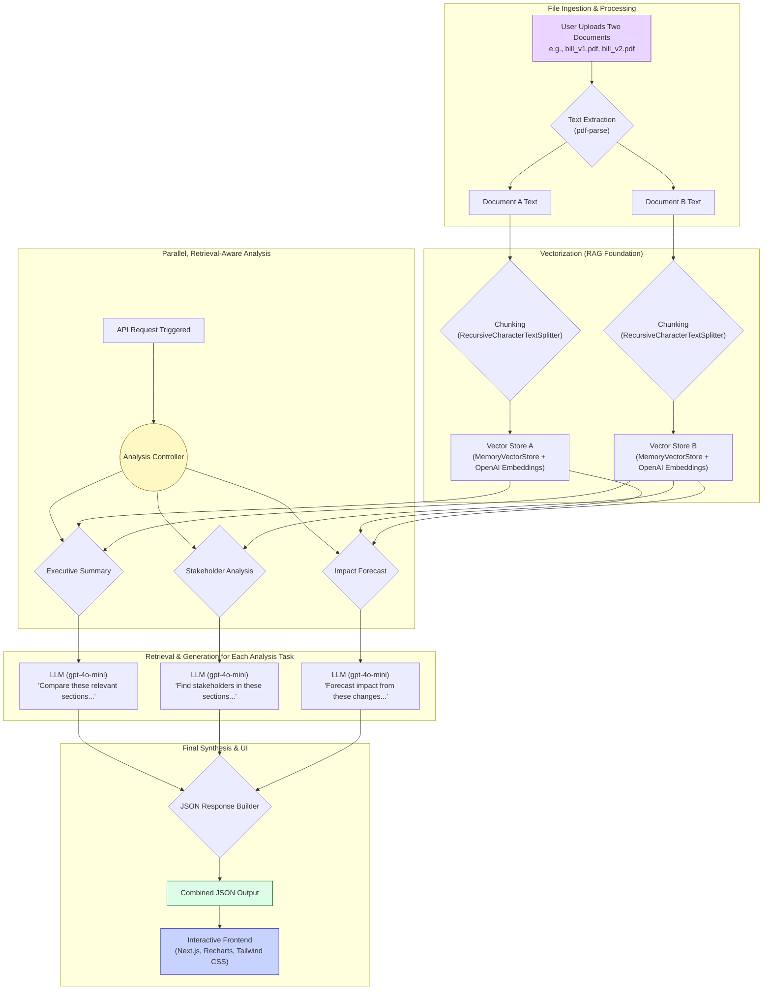

# 🏛️ Doge: Legislative Analysis Platform

**Last Updated: July 29, 2024**

Doge is a sophisticated, AI-powered platform designed to bring clarity and transparency to the complex world of legislation. It allows users to upload two versions of a legislative document and receive a comprehensive, easy-to-understand analysis of the changes, the stakeholders involved, and the potential long-term impacts.

This tool is built for legislative staffers, journalists, and engaged citizens who need to quickly understand the substance and implications of a bill without spending days wading through dense legal jargon.

## 🚀 Live Demo & Key Features

*(Link to your live demo deployed on Vercel/Netlify would go here)*

*   **Document Comparison:** Upload `.txt` or `.pdf` versions of a bill.
*   **Executive Summary:** Get a high-level overview of the most critical changes.
*   **Interactive Stakeholder Analysis:** Visualize the impact on different groups with an interactive bar chart.
*   **Visual Impact Forecast:** Understand the short, medium, and long-term consequences with a clear timeline view.
*   **Clean, Professional UI:** A polished, government-inspired interface that makes complex data easy to digest.

## 🧠 The AI Architecture: A True RAG Pipeline

The core of this project is its advanced **Retrieval-Augmented Generation (RAG)** pipeline. This is not a simple prompt-chaining system that passes entire documents to an LLM. Instead, it uses a more sophisticated, efficient, and scalable approach.

### Architecture Diagram



### How It Works:

1.  **Ingestion & Vectorization:** When a user uploads two documents, the text is extracted. Each document is then broken down into smaller, semantically meaningful chunks using a `RecursiveCharacterTextSplitter`. These chunks are then converted into numerical representations (embeddings) using OpenAI's embedding models and stored in an in-memory `MemoryVectorStore`. This creates a searchable knowledge base for each document.

2.  **Parallel, Retrieval-Aware Analysis:** Instead of running one large, slow analysis, we run multiple, smaller, specialized analyses in parallel. For each task (e.g., "Executive Summary," "Stakeholder Analysis"), we perform a search over the vector stores to find the *most relevant chunks of text*.

3.  **Targeted Generation:** Only these highly relevant, retrieved chunks are passed as context to the Large Language Model (in this case, `gpt-4o-mini`). This is the "Augmented Generation" part of RAG. It's more efficient, less expensive, and produces more accurate and grounded results than passing the full text.

4.  **Synthesis & UI:** The JSON outputs from each parallel analysis chain are combined into a single, comprehensive response and sent to the frontend, which then renders the interactive charts and report.

## 🛠️ Tech Stack

*   **AI/Backend:**
    *   [LangChain.js](https://js.langchain.com/): The core framework for building our RAG pipeline.
    *   [OpenAI](https://openai.com/): For state-of-the-art text generation and embeddings.
    *   [Next.js App Router](https://nextjs.org/): For the serverless API that runs the entire analysis pipeline.
*   **Frontend:**
    *   [Next.js](https://nextjs.org/) & [React](https://react.dev/): For building the user interface.
    *   [TypeScript](https://www.typescriptlang.org/): For type-safe code.
    *   [Tailwind CSS](https://tailwindcss.com/): For utility-first styling.
    *   [Recharts](https://recharts.org/): For creating the interactive data visualizations.
    *   [axios](https://axios-http.com/): For making API requests to our backend.
*   **Tooling:**
    *   [pnpm](https://pnpm.io/): For fast and efficient package management.
    *   [Vercel](https://vercel.com/): For deployment (recommended).

## 🚀 Getting Started

### Prerequisites

*   Node.js (v18 or later)
*   pnpm (or npm/yarn)
*   An OpenAI API key

### Installation & Setup

1.  **Clone the repository:**
    ```bash
    git clone https://github.com/your-username/contest-doge.git
    cd contest-doge
    ```

2.  **Install dependencies:**
    ```bash
    pnpm install
    ```

3.  **Set up your environment variables:**
    Create a new file named `.env.local` in the root of the project and add your OpenAI API key:
    ```
    OPENAI_API_KEY=your_openai_api_key_here
    ```

4.  **Run the development server:**
    ```bash
    pnpm dev
    ```

The application should now be running at [http://localhost:3000](http://localhost:3000). You can start by uploading two documents on the homepage.

---

This README.md is now a comprehensive guide to your project. It not only tells people *what* it is but also *how* it works, showcasing the quality of the engineering behind it. Good luck!
