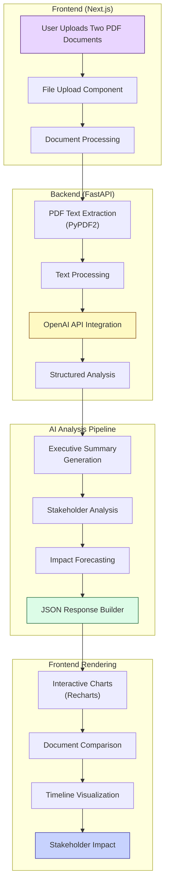

# Legislative Analysis Platform

**Last Updated: January 2025**

Doge is a sophisticated, AI-powered platform designed to bring clarity and transparency to the complex world of legislation. It allows users to upload two versions of a legislative document and receive a comprehensive, easy-to-understand analysis of the changes, the stakeholders involved, and the potential long-term impacts.

This tool is built for legislative staffers, journalists, and engaged citizens who need to quickly understand the substance and implications of a bill without spending days wading through dense legal jargon.

## 🚀 Live Demo & Key Features

*(Link to your live demo deployed on Vercel/Netlify would go here)*

*   **Document Comparison:** Upload `.pdf` versions of a bill for side-by-side analysis.
*   **Executive Summary:** Get a high-level overview of the most critical changes with detailed citations.
*   **Interactive Stakeholder Analysis:** Visualize the impact on different groups with interactive charts.
*   **Visual Impact Forecast:** Understand the short, medium, and long-term consequences with a clear timeline view.
*   **Clean, Professional UI:** A polished, government-inspired interface that makes complex data easy to digest.
*   **Evidence-Based Analysis:** Direct quotes and citations included for verification and transparency.

## 🧠 The AI Architecture: FastAPI + OpenAI Integration

The core of this project uses a **FastAPI backend** with **OpenAI integration** for intelligent document analysis. The system processes PDF documents and provides comprehensive legislative analysis through structured AI prompts.

### Architecture Diagram



### How It Works:

1.  **Document Upload & Processing:** Users upload two PDF documents through the Next.js frontend. The FastAPI backend uses PyPDF2 to extract text from both documents.

2.  **AI Analysis:** The extracted text is sent to OpenAI's GPT-4o-mini model with carefully crafted prompts that request structured JSON responses containing:
    - Executive summary with key changes and citations
    - Stakeholder analysis identifying affected groups
    - Impact forecasting for economic, social, and political effects

3.  **Structured Response:** The AI returns a comprehensive JSON structure that includes:
    - Document overview and primary subject
    - Key debate topics with supporting quotes
    - Most significant changes with evidence
    - Political implications and implementation challenges
    - Stakeholder analysis with effect categorization
    - Impact forecasts for 1-year, 3-year, and 5-year timelines

4.  **Interactive Frontend:** The Next.js frontend renders the analysis results using:
    - Interactive charts and visualizations (Recharts)
    - Side-by-side document comparison
    - Timeline-based impact forecasting
    - Stakeholder analysis with categorization
    - Evidence-based citations and quotes

## 🛠️ Tech Stack

*   **Backend:**
    *   [FastAPI](https://fastapi.tiangolo.com/): Modern, fast web framework for building APIs
    *   [PyPDF2](https://pypdf2.readthedocs.io/): PDF text extraction and processing
    *   [OpenAI](https://openai.com/): State-of-the-art text generation and analysis
    *   [Uvicorn](https://www.uvicorn.org/): ASGI server for FastAPI
    *   [Pydantic](https://pydantic.dev/): Data validation and settings management

*   **Frontend:**
    *   [Next.js 15](https://nextjs.org/) & [React 19](https://react.dev/): For building the user interface
    *   [TypeScript](https://www.typescriptlang.org/): For type-safe code
    *   [Tailwind CSS 4](https://tailwindcss.com/): For utility-first styling
    *   [Recharts](https://recharts.org/): For creating interactive data visualizations
    *   [Framer Motion](https://www.framer.com/motion/): For smooth animations
    *   [React PDF](https://react-pdf.org/): For PDF preview and processing
    *   [Axios](https://axios-http.com/): For making API requests

*   **Development Tools:**
    *   [pnpm](https://pnpm.io/): For fast and efficient package management
    *   [ESLint](https://eslint.org/): For code linting
    *   [Vercel](https://vercel.com/): For deployment (recommended)

## 🚀 Getting Started

### Prerequisites

*   Node.js (v18 or later)
*   Python 3.8 or later
*   pnpm (or npm/yarn)
*   An OpenAI API key

### Installation & Setup

1.  **Clone the repository:**
    ```bash
    git clone https://github.com/your-username/contest-doge.git
    cd contest-doge
    ```

2.  **Install frontend dependencies:**
    ```bash
    pnpm install
    ```

3.  **Install backend dependencies:**
    ```bash
    cd backend
    python -m venv venv
    source venv/bin/activate  # On Windows: venv\Scripts\activate
    pip install -r ../requirements.txt
    cd ..
    ```

4.  **Set up your environment variables:**
    Create a new file named `.env.local` in the root of the project and add your OpenAI API key:
    ```
    OPENAI_API_KEY=your_openai_api_key_here
    ```

5.  **Start the backend server:**
    ```bash
    cd backend
    python main.py
    ```
    The FastAPI server will start on `http://localhost:8000`

6.  **Start the frontend development server:**
    ```bash
    pnpm dev
    ```

The application should now be running at [http://localhost:3000](http://localhost:3000). You can start by uploading two PDF documents on the homepage.

## 📁 Project Structure

```
contest-doge/
├── app/                          # Next.js frontend application
│   ├── api/                      # API routes
│   │   ├── compare/              # Document comparison endpoint
│   │   ├── healthz/              # Health check endpoint
│   │   └── test-pdf/             # PDF testing endpoint
│   ├── components/               # React components
│   │   ├── homepage/             # Homepage-specific components
│   │   ├── interactive/          # Interactive UI components
│   │   └── layout/               # Layout components
│   ├── compare/                  # Comparison pages
│   └── globals.css               # Global styles
├── backend/                      # FastAPI backend
│   ├── main.py                   # Main FastAPI application
│   └── venv/                     # Python virtual environment
├── lib/                          # Utility libraries
├── public/                       # Static assets
└── requirements.txt              # Python dependencies
```

## 🔧 API Endpoints

### Backend (FastAPI)

- `GET /` - Health check
- `GET /health` - Detailed health check with OpenAI status
- `POST /api/test-pdf` - Test PDF text extraction
- `POST /api/compare` - Compare two PDF documents

### Frontend (Next.js)

- `GET /api/compare` - Proxy to backend comparison endpoint
- `GET /api/healthz` - Frontend health check
- `GET /api/test-pdf` - Frontend PDF testing endpoint

## 🎨 UI Components

The application includes a comprehensive set of React components:

- **Document Processing:** `FileDropzone`, `FileUpload`
- **Analysis Display:** `ExecutiveSummary`, `KeyChanges`, `StakeholderAnalysis`, `ImpactForecast`
- **Interactive Visualizations:** `StakeholderChart`, `SectorImpactVisualization`, `TimelineForecast`
- **Document Comparison:** `DiffViewer`, `LineByLineViewer`
- **UI Elements:** `Card`, `SkeletonLoader`, `LoadingAnimation`

## 🔒 Security & Privacy

- **No Data Retention:** Documents are processed in memory and deleted after analysis
- **Encrypted Processing:** All data transmission uses HTTPS
- **Privacy Protected:** No user tracking or data collection
- **Secure API:** OpenAI API calls are made server-side with proper error handling

## 🤝 Contributing

1. Fork the repository
2. Create a feature branch (`git checkout -b feature/amazing-feature`)
3. Commit your changes (`git commit -m 'Add some amazing feature'`)
4. Push to the branch (`git push origin feature/amazing-feature`)
5. Open a Pull Request

## 📄 License

This project is licensed under the MIT License - see the LICENSE file for details.

---

This README.md provides a comprehensive guide to your project, showcasing the FastAPI + OpenAI architecture and the sophisticated frontend components. The platform is designed for government use with a professional, accessible interface that makes legislative analysis accessible to everyone.
